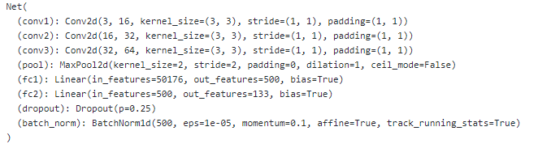

# Dog_Breed_Classifier_CNN

Dog Breed Classification Project which uses CNN's to classify real world dog images and predict their breed out of 133 breeds/classes.
If supplied an image of a human face, the code will identify the resembling dog breed.  Achieved an accuracy of 81% (with just one epoch!!!) using VGG-16 and Transfer learning.

I learned how to build a pipeline that can be used within a web or mobile app to process real-world, user-supplied images.
Transfer learning was also used to use already trained models (VGG-16 in this case) which perform well.These models take weeks to train on high-end GPU's and hence it's not feasible to train them on PC.

## Project Information

### Contents

- Intro
- Step 0: Import Datasets
- Step 1: Detect Humans                                                           Accuracy-98%
- Step 2: Detect Dog                                                              Accuracy-98%
- Step 3: Create a CNN to Classify Dog Breeds (from Scratch)                      Accuracy-16%
- Step 4: Create a CNN to Classify Dog Breeds (using Transfer Learning)           Accuracy-81% 
- Step 5: Writing Own Algorithm
- Step 6: Testing Own Algorithm

### Main CNN Model

I used this architecture in the step 3 

and I used VGG-16 for the transfer learning in step 4. Here is the architecture of VGG-16:

 ## Final Prediction
 
 

### Libraries

The list below represents main libraries and its objects for the project.
- [PyTorch](https://pytorch.org/) (Convolutional Neural Network)
- [OpenCV](https://opencv.org/) (Human Face Detection)
- [Matplotlib](https://matplotlib.org/) (Plot Images)
- [Numpy](http://www.numpy.org/) 

### Accelerating the Training Proecess

In the training step in the Step 3 and 4, it will take too long to run so you will need to either reduce the complexity of the VGG-16 architecture or switch to running the code on a GPU or use Google Colab.

#### Amazon Web Services

I Used Amazon Web Services to launch an EC2 GPU instance. (This costs money!)
